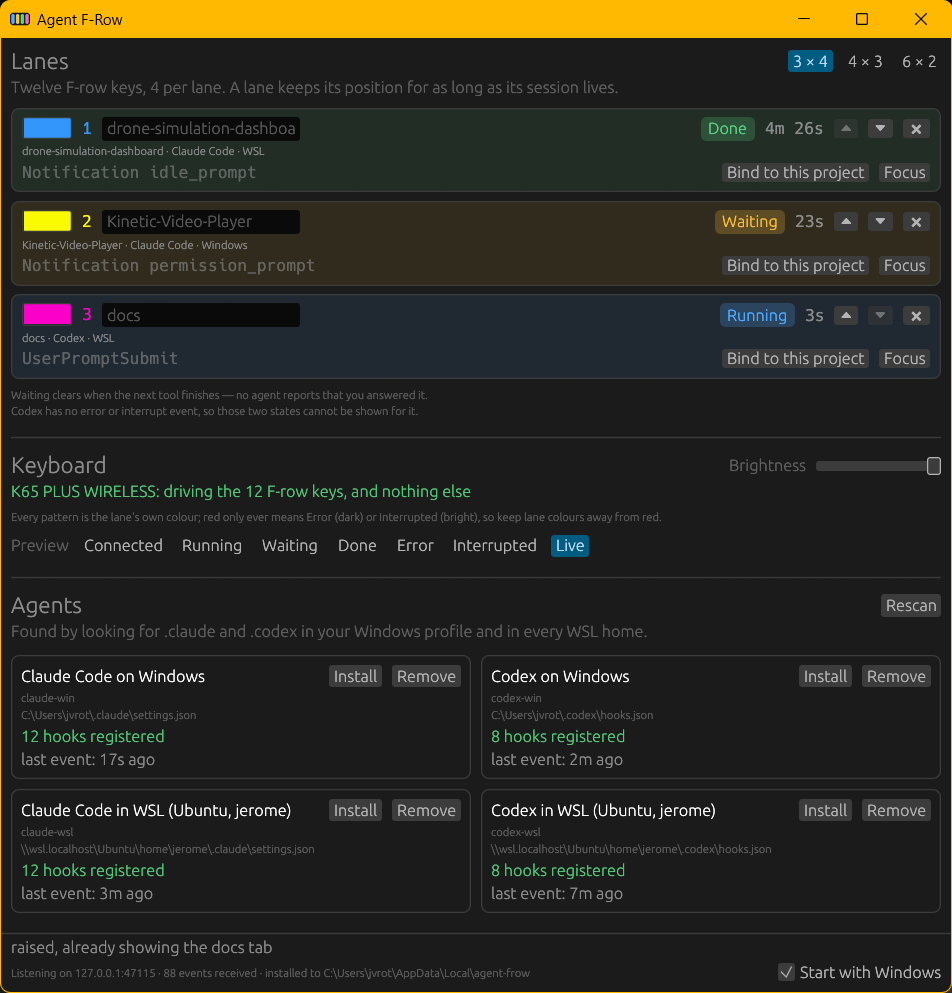

# Agent F-Row

Your coding agents, on your keyboard's F-row — or on a numpad, or a Stream
Deck. Each agent gets a lane of lit keys that shows what it is doing —
working, done, **waiting for you** — one press on the lane's key brings that
agent's window to the front, and while it is waiting, three more keys answer
it.

https://github.com/user-attachments/assets/2d799d6d-d815-481b-9ae2-f113a0af6aeb

## Supported devices

| Device | Shows | Needs | Status |
|---|---|---|---|
| **Corsair** keyboards through iCUE — K65 Plus Wireless, K70 TKL | the F-row as lanes: colour and motion per state; F13–F24 as the lanes' keys — summon, and ▲▼Enter while Waiting | iCUE with third-party control on; the F-row remapped to F13–F24 in the default profile | verified |
| **Keychron Ultra** — V3 Ultra 8K (the other Ultras speak the same protocol) | the F-row as lanes; the same keys, from the Launcher keymap | the cable or the 2.4 GHz receiver, not Bluetooth; Keychron's per-key-brightness fix for true darks | verified |
| **Elgato Stream Deck** — 2019 V2, 15 keys (every model with a screen, through the driver) | one row per lane: name, context, 5h, 7d, state; every key a summon; ▲▼Enter while Waiting | USB; the Stream Deck app closed | verified |
| **The monitor** — mini mode | the same rows on screen, five keys each; click a key to summon | nothing | verified |
| **Keychron V0 Ultra** — the numpad | the M column one key per agent, up to five — glow, breathe, double pulse, full, red — and the four shape keys as a top line showing one agent in the F-row's patterns; the knob picks which (press to lock), an M key selects and summons, the top line summons and answers ⏶⏷Enter while Waiting | the cable or the 2.4 GHz receiver; the per-key-brightness fix; the knob and keys remapped to Ctrl+Shift+F13–F24 by importing [the keymap file](firmware/keychron-ultra/keymaps/) | verified, two boards |

Without any of them the window shows everything; the keys and the light are
the part you would be missing.

## Why

You have Claude Code in one terminal, Codex in another, a third agent in its
desktop app — and then you go do something else. Which one is sitting on a
permission prompt right now? Agent F-Row answers that from across the room: a
lane pulsing in its colour needs you, and pressing its key puts you in front of
it.

- **Windows only.** Works with **Claude Code** and **Codex**, each running
  natively on Windows and inside WSL.
- **The light is a Corsair keyboard through iCUE, a Keychron Ultra or V0
  Ultra numpad on its cable or 2.4 GHz receiver, or an Elgato Stream
  Deck.** Without one the
  window still shows everything; the keys and the light are the part you
  would be missing.
- **Display, and two presses.** It never answers a hook, never approves or
  denies anything, and never acts on its own; its reply to every hook is
  empty. Any of a lane's keys brings the agent's window forward. While a lane
  is Waiting, three of them — the lane's second, third and fourth on the
  F-row, a row's three middle keys on a Stream Deck, the numpad's top line for
  the agent it shows — send one Up, Down or Enter, only into a terminal that
  verifiably has the keyboard. The agents
  talk to it over loopback on your machine, and nothing leaves it. Of Claude's
  status-line JSON, three percentages reach the app — context used, the
  five-hour and seven-day limits — and the JSON goes on to your own status
  line untouched.

## What you see

### On the keys

Twelve F-row keys, three lanes of four; each device carries as many lanes as
it has keys for — the F-row three, the numpad's M column five, a deck one per
row — and the window shows them all. Each lane has its own colour, and every
state is that colour at some brightness and motion — a *change* of colour
means trouble, and red means Error and nothing else.

| State | On the keys | Meaning |
|---|---|---|
| Connected | all keys, dim | alive, nothing run yet |
| Running | one light sweeping along the lane | working |
| Waiting | first key full, the three after it double-pulsing — those are ▲ ▼ Enter | **needs you** — a permission prompt or a question |
| Done | first key full, the rest dim | the turn finished |
| Error | first key full, the rest dark red | the turn failed |
| Idle | first key dim, the rest off | nothing heard for a while |
| empty | off | no agent on this lane |

On the numpad an agent is one key, so the M column says the same thing with
less: Connected and Idle rest dim, Running breathes, Waiting double-pulses,
Done holds full, Error is dark red; the selected agent's key sits brighter,
and a locked one fades to white and back. The four shape keys above are a top
line showing that agent in the patterns of the table.

Idle is silence, not a verdict: Done and Connected dim to Idle after 30
minutes, Running after 2 hours, and Waiting and Error never — they are exactly
what you left to come back to. A session leaves only when its agent ends or
you dismiss it, so the board you left is the board you come back to.

### In the window

The lanes, each with its state, the last thing the agent did, how long it has
been like that — a Waiting lane counts it in its pill, "Waiting 12m", since
how long you have been asked is the signal — and a **Focus** button — and, when known, the numbers:
context used, the five-hour and seven-day limits; in Error, the reason
beside the state ("rate limit", "overloaded", "auth"). Sessions beyond the lane count live
**off the keyboard** — fully tracked, no key or light — and take the next lane
that frees up. The ⏶⏷ arrows reorder lanes; nothing else ever moves a lane out
from under you.

**Saved agents.** Press *Save* on a lane and the app remembers that agent and
project folder, with that lane as its preferred one. Next time the agent
starts it lands there if the lane is free, otherwise on another lane. The
saved roster lists the ones that are not running, and is where you change a
preference or forget it.

**Mini mode.** The *Mini mode* button, or a double-click on a lane or an
off-keyboard card, folds the window down to a Stream Deck's picture of the
agents: one row per agent with a session — lanes first, then the off-keyboard
ones — five keys to a row: the name, context used, the five-hour and
seven-day limits, and the state over how long — in Waiting, how long over
the state, the minutes as the headline — lit exactly as on the keyboard. No
title bar: drag the background to move it, the bottom-right
corner to resize it, and it opens next time where you left it, at the size
you left it, on top of everything. Clicking a key focuses that agent, and
what the focus did shows over the rows for a few seconds; double-click
anywhere else to get the full window back.

### Focus

Press any of the lane's keys (or click Focus) and the window the agent runs in
comes forward — Windows Terminal with the right tab in front (including a tab
torn out into its own window), the Claude or Codex desktop app, or an IDE. No
approvals, no key capture. Nothing is ever typed into a window that merely
came forward: the answer keys — on the keyboard or a Stream Deck — send their
one key only after Windows says the terminal has the keyboard, and otherwise
say "press again".

The tab it looks for is the lane's name, then the project folder — so naming a
lane is a feature. If no tab matches, it says so and lists the tabs it found,
rather than leaving you looking at the wrong agent.

Two limitations, stated in the window too: no agent reports when you *answer*
a permission prompt, so a lane can read Waiting after you approved until that
tool finishes — seconds for Claude; for Codex, which reports a command only
once it exits, a server or long install you allowed holds Waiting until a
later command finishes (a Codex *question* is the exception, and clears the
moment you answer it); and Codex has no error event, so Error cannot be shown
for it.

## Install

1. Download `agent-frow-<version>-win64.zip` from
   [Releases](https://github.com/timeToy34/agent-frow/releases), unzip it
   anywhere, and run `agent-frow.exe` **once**. It installs itself to
   `%LOCALAPPDATA%\agent-frow`, registers its hook with every Claude Code and
   Codex it finds (Windows and WSL), and hands over to the installed copy; the
   unzipped folder can be deleted.
2. Restart your agents so they read their hooks. **Codex also needs `/hooks`
   run inside it and the entry trusted** — until then it looks installed and
   nothing happens.
3. For a keyboard: remap the F-row to **F13–F24** in the keyboard's own
   software; for the V0 Ultra numpad, import the keymap file in the Launcher
   — see [Keyboards](#keyboards) for each.

Upgrading is the same gesture with a newer zip. "Start with Windows" is a
checkbox in the window. Windows will warn on first run: the zip is not
code-signed.

The window's **Settings** section lists every agent found, whether its hook is
registered, and when it was last heard from, with Install and Remove per agent.

## Keyboards

Two keyboards, a numpad and a Stream Deck are supported, and all may be
plugged in at once. On a keyboard the app touches only the twelve F-row LEDs,
on the numpad nine, and leaves the rest of the board to you. The F-row is
three lanes of four keys: any key of a lane brings its agent forward, and
while the lane is Waiting the three after the first are **Up, Down and
Enter** — the same rule as a Stream Deck row and as the numpad's top line,
with the same care about where the keystroke goes. A held key is one answer,
not a stream of them.

**Corsair, through iCUE.** iCUE running with third-party control enabled,
and the F-row remapped to F13–F24 in the **default** profile — a profile
switch silently takes the summon keys with it. The app paints on a shared
layer above your own lighting.

**Keychron Ultra (V3 Ultra 8K verified; the other Ultras speak the same
protocol).** No driver and nothing to install: the app uses the raw-HID
protocol the Keychron Launcher itself uses, over the **cable or the 2.4 GHz
receiver** — the firmware does not carry it over Bluetooth. Remap F1–F12 to
F13–F24 in the Launcher keymap; that lives in the keyboard, so the lane
keys work over Bluetooth too. The keyboard's mixed mode gives the F-row to the
app and keeps your own effect on every other key (with your lighting off the
app paints the rest black itself, so the Caps Lock indicator can still switch
off); everything the app changes is read first and put back on Quit, and
nothing is ever written to the keyboard's flash. One caveat: **stock firmware ignores per-key brightness**,
so every lit key shows at full and dark keys show white until Keychron ships
[their fix](https://github.com/Keychron/zmk/pull/9). Until then,
[firmware/keychron-ultra](firmware/keychron-ultra/README.md) builds their
firmware with the fix applied and explains how the Launcher flashes it — read
it before deciding. `agent-frow doctor` lists what it finds on the bus.

**Keychron V0 Ultra (the numpad; verified on two boards).** The same
protocol, the same cable-or-receiver rule and the same brightness caveat as
the Ultra above — `./build.sh keychron_v0_ultra_ansi` in the same folder
builds the numpad's firmware with the fix, and the Launcher flashes it the
same way. The knob and the nine keys the app uses send **Ctrl+Shift+F13–F24**,
and the Launcher's key picker cannot enter a chord — it only records a key
you physically press — so the keymap goes in as a file: in the Launcher's
Keymap tab, **Export** your current keymap first (that is your undo), then
**Import** [keychron_v0_ultra_ansi.json](firmware/keychron-ultra/keymaps/keychron_v0_ultra_ansi.json)
over the cable. It is the stock layout with the knob and those nine keys
changed; the numpad keys stay numpad keys. M5 stops being Fn — everything
Fn did is in the Launcher's Lighting tab. In use: M1–M5 are lanes 1–5, one
key each, and the top line shows one of them in the F-row's patterns. The
knob picks which — unlocked, the top line follows whatever changed last;
press the knob to lock it there and the M key fades to white and back.
Pressing an M key selects that agent and brings its window forward; the top
line's four keys bring the shown agent forward, and while it is Waiting the
three after the first answer **Up, Down and Enter**. With a Preview playing
the knob and the M keys work on every lit key, so the cursor and the lock
can be seen before any agent is there.

**Elgato Stream Deck (a 2019 V2 with 15 keys verified; the driver knows
every model with a screen).** Plain USB, no driver, nothing to install. One row per lane, like a
five-key F-row, in the same colours and motion as on the keyboard: the left
key is the lane's name — on an empty lane, what it is for: "next agent
here" on the lowest free lane, "free" on the rest; the three between show **context used, the five-hour
limit and the seven-day limit** as percentages (a dash until known); the
right key is the state over how long — in Waiting, how long over the state,
the minutes as the headline; in Error, over why: "rate limit",
"overloaded", "auth". While a lane is Waiting the three middle keys become
**Up, Down and Enter**, so a question gets answered from the deck; the app
never presses anything on its own, and sends the key only into a terminal
that verifiably has the keyboard. Every key of a row focuses the lane. A
15-key deck shows lanes 1–3, and the window says which lanes are on it. The
deck cannot be shared with the Stream Deck app, which repaints every key and
reads every press, so **quit the Stream Deck app** and Agent F-Row takes the
deck; start it again and the deck is handed back within ten seconds. On Quit
the deck goes back to its logo. `agent-frow doctor` lists it too.

The numbers come from where the agents keep them: for Claude, its status
line — `install` registers Agent F-Row as the status-line command, or wraps
the one you have so it keeps rendering exactly as before; for Codex, the
session's own log, read by the app. The limits are your account's, so every
lane of one account shows the same two. `agent-frow doctor` says whether the
status line is registered.

## Settings

- Lane count — three to six; each device carries as many lanes as it has
  keys for — the F-row three, the numpad five, a deck one per row — and the
  window and mini mode show them all — and each lane's name and colour.
- Each device on its own line, with a tick in front: untick one to leave it
  alone — plugged in, found, and not driven — and tick it to take it back.
  Brightness (☀) for all of them and **colour balance** (🎨, a per-channel
  gain for keyboards whose LEDs do not match the screen) for the keyboards —
  the deck is a screen and takes none. Tune with a **Preview** pattern
  playing on the keys.
- Everything lives in `%LOCALAPPDATA%\agent-frow\settings.json`, written
  atomically. A file that does not parse is refused and left alone, and the
  window says so.

## Building from source

Rust on Windows. `cargo build --release`, then
`target\release\agent-frow.exe install` — the app runs from `%LOCALAPPDATA%`,
and only `install` puts a build there. For Corsair lighting, unzip Corsair's
iCUE SDK (not committed; its own license) at `<repo>/iCUESDK`; Keychron needs
nothing extra. `dist.ps1` builds the release zip.

How it all works — the hook, the state machine, lane placement, the lighting,
focus — is in [docs/how-it-works.md](docs/how-it-works.md); the reasons behind
each rule, measured against real sessions, are in
[docs/lessons.md](docs/lessons.md).

## Contributing

Issues and pull requests are welcome. **Before changing the state machine,
focus, the hook, or the lighting, read [docs/lessons.md](docs/lessons.md)** —
the constraints there were measured against real sessions, and in two cases
the agent documentation is wrong. CI checks formatting, lints and tests the
hook crate on Linux, and builds the whole workspace on Windows; the GUI only
compiles on Windows. If a change touches summon keys, focus, or lighting, say
what hardware you verified it on.

## License

MIT — see [LICENSE](LICENSE). The one exception is
`iCUESDK.x64_2019.dll` in release zips: that file is Corsair's proprietary iCUE
SDK redistributable, covered by
[Corsair's EULA](https://corsairofficial.github.io/cue-sdk/#end-user-license-agreement),
not by this project's license.
